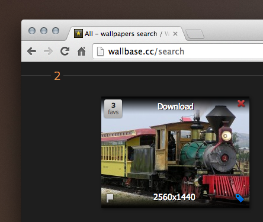
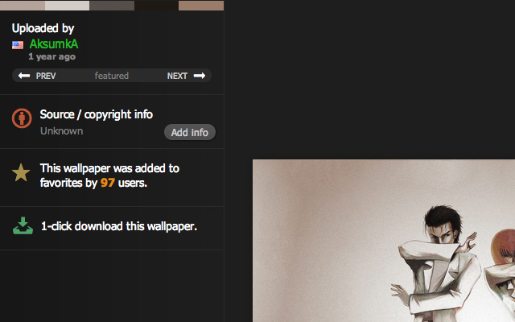

Wallhaven Direct Downloader
==========================

A Chrome extension to download Wallhaven's wallpapers straight from the search page !

This extension adds a direct download link to thumbnails, simply hover over a thumbnail to see it.

Install
==========================

Just grab and install the extension from Chrome Web Store :
[https://chrome.google.com/webstore/detail/wallbase-direct-downloade/mggclgefcmlpigdbcpfheklbhflnknkf](https://chrome.google.com/webstore/detail/wallbase-direct-downloade/mggclgefcmlpigdbcpfheklbhflnknkf)

# Installation (Opera)

Better TweetDeck has been proven to work on Opera using the [Download Chrome Extension](https://addons.opera.com/en/extensions/details/download-chrome-extension-9/?display=en) add-on. Follow those steps to install Better TweetDeck on Opera :

1. Download "[Download Chrome Extension](https://addons.opera.com/en/extensions/details/download-chrome-extension-9/?display=en)"
2. Get [Wallhaven Direct Downloader on the Chrome Web Store](https://chrome.google.com/webstore/detail/wallbase-direct-downloade/mggclgefcmlpigdbcpfheklbhflnknkf)
3. Install it like you would on Chrome
4. Confirm the installation because Opera will freak out about the origin of the extension
5. ???
6. PROFIT !!! :tada: 

Screenshot
==========================

Changelog
==========================

1.0.0
- Revamped the code to work with Wallhaven
- New icon
- Lighter extension

0.0.8
- Added a 1-click download button on wallpapers page (http://wallbase.cc/wallpaper/*)
- The extension doesn't need the access everywhere anymore.

0.0.6.2
- Now the extension works if you disable the lazy-loading in Wallhaven's preferences.

0.0.6
- The extension is now handling correctly wallpapers in PNG format thanks to super-awesome XMLHttpRequests ! Yay for technology !

0.0.5.1
- Fixed a bug introduced by the multiple thumbnail sizes feature

0.0.5 : 
- Added the support of the multiple thumbnails format of Wallhaven and fixed the url accordingly

0.0.4 : 
- Changed the "Download" link to 2 icons, then you can preview OR download the wallpaper directly !

