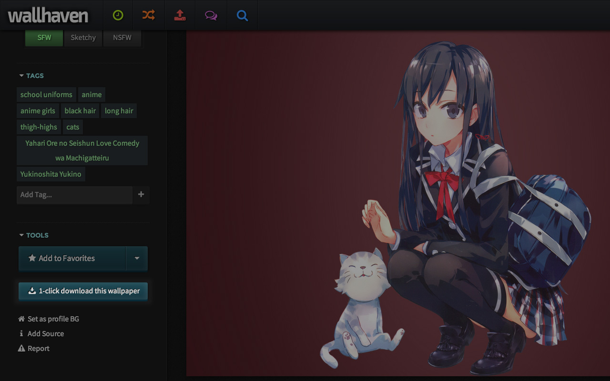

WallbaseDownloadFromSearch
==========================

A Chrome extension to download Wallbase's wallpapers straight from the search page !

This extension adds a direct download link to thumbnails, simply hover over a thumbnail to see it.

Install
==========================

Just grab and install the extension from Chrome Web Store :
[https://chrome.google.com/webstore/detail/wallbase-direct-downloade/mggclgefcmlpigdbcpfheklbhflnknkf](https://chrome.google.com/webstore/detail/wallbase-direct-downloade/mggclgefcmlpigdbcpfheklbhflnknkf)

Screenshot
==========================

Changelog
==========================

0.0.7
- Added a 1-click download button on wallpapers page (http://wallbase.cc/wallpaper/*)
- The extension doesn't need the access everywhere anymore.

0.0.6.2
- Now the extension works if you disable the lazy-loading in Wallbase's preferences.

0.0.6
- The extension is now handling correctly wallpapers in PNG format thanks to super-awesome XMLHttpRequests ! Yay for technology !

0.0.5.1
- Fixed a bug introduced by the multiple thumbnail sizes feature

0.0.5 : 
- Added the support of the multiple thumbnails format of Wallbase and fixed the url accordingly

0.0.4 : 
- Changed the "Download" link to 2 icons, then you can preview OR download the wallpaper directly !

